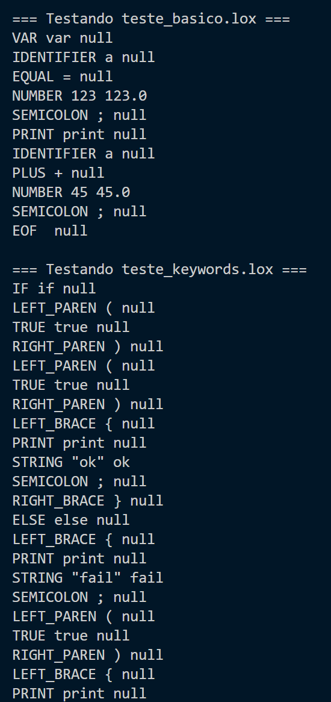
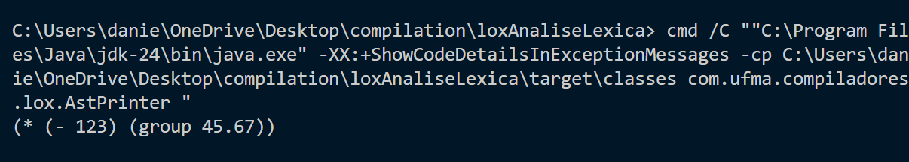
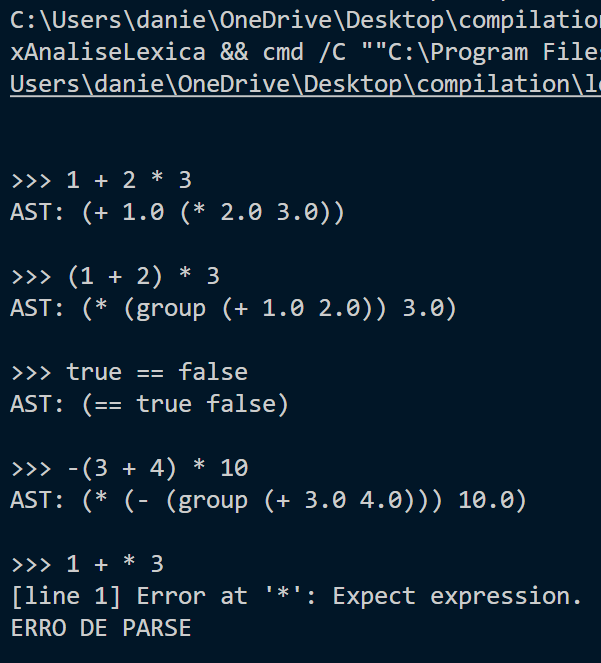

# Lox: Análise Léxica

## Integrantes da Dupla

| Nome Completo                     | Usuário do GitHub |
| :-------------------------------- | :---------------- |
| **Daniel Campos Galdez Monteiro** | `DanielKGM`       |
| **Gustavo Antonio Silva Rocha**   | `isgust`          |

---

## Descrição do Projeto

Este projeto é a primeira etapa no desenvolvimento de um interpretador para a linguagem **Lox**, conforme apresentado no livro _Crafting Interpreters_.

Nesta fase, o foco principal é a **Análise Léxica (Scanning)**. O objetivo é construir a infraestrutura básica necessária para ler o código-fonte Lox e convertê-lo em uma sequência de _tokens_, que são as unidades mínimas de significado da linguagem.

## Resultados

### Teste Seção 4.5 _The Scanner Class: Recognizing Lexemes_

Arquivos de entrada `teste_basico.lox` e `teste_keywords`, respectivamente:

```
// teste_basico.lox
var a = 123;
print a + 45;

// teste_keywords.lox
if (true) {
  print "ok";
} else {
  print "fail";
}
```

Resultados obtidos rodando `ScannerTest.java`, responsável por testar `Scanner.java`:


O teste funcionou perfeitamente, mas o scanner ainda não foi completado.

A saída é esperada, pois a implementação parou logo após tratar lexemas de um caractere, na [seção 4.5](https://craftinginterpreters.com/scanning.html#recognizing-lexemes).

### Teste Seção 4.7 _The Scanner Class: Recognizing Longer Lexemes and Keywords_

Os arquivos de entrada `teste_basico.lox` e `teste_keywords` foram rodados novamente após implementar _recognizing longer lexemes_ ([seção 4.6](https://craftinginterpreters.com/scanning.html#longer-lexemes)) e _reserved words and identifiers_ ([seção 4.7](https://craftinginterpreters.com/scanning.html#reserved-words-and-identifiers)). A saída resultante está registrada na figura abaixo:



Claramente foram gerados mais tokens, tanto para palavras reservadas como "print" quanto para números e strings com lexemas mais longos, por exemplo. Pode-se dizer que a classe Scanner está cada vez mais completa.

### Teste Seção 5.4 _A Not Very Pretty Printer_

A classe `AstPrinter` foi executada, o resultado está na imagem a seguir:



Ele imprime como o interpretador enxerga e organiza os operadores e valores antes de executar algo.

### Teste Capítulo 6: _Parser_

A classe **`ParserTest.java`** foi executada para validar o funcionamento do parser e construção da AST.

A lista de entradas testadas foi:

```
1 + 2 * 3
(1 + 2) * 3
true == false
-(3 + 4) * 10
1 + * 3
```

A seguir está a imagem com a saída produzida pelos testes:



Os testes confirmam que o parser:

- Respeita a precedência de operadores (`*` antes de `+`).
- Processa agrupamentos com `(` `)`.
- Reconhece operadores de igualdade e booleanos.
- Detecta erros sintáticos como em `1 + * 3`.

## Referência

- **Livro Base:** _Crafting Interpreters_.
- **Seção de Referência para esta Etapa:** [Scanning - Capítulo 4](http://www.craftinginterpreters.com/scanning.html)

---

_Data de Entrega: 30 de Outubro_
