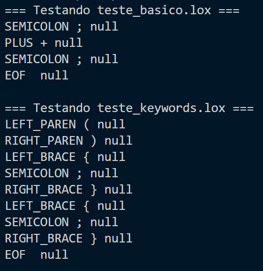

# Lox: Análise Léxica

## Integrantes da Dupla

| Nome Completo                     | Usuário do GitHub |
| :-------------------------------- | :---------------- |
| **Daniel Campos Galdez Monteiro** | `DanielKGM`       |
| **Gustavo Antonio Silva Rocha**   | `isgust`          |

---

## Descrição do Projeto

Este projeto é a primeira etapa no desenvolvimento de um interpretador para a linguagem **Lox**, conforme apresentado no livro _Crafting Interpreters_.

Nesta fase, o foco principal é a **Análise Léxica (Scanning)**. O objetivo é construir a infraestrutura básica necessária para ler o código-fonte Lox e convertê-lo em uma sequência de _tokens_, que são as unidades mínimas de significado da linguagem.

## Teste Sessão 2.5 _The Scanner Class: Recognizing Lexemes_

Arquivos de entrada `teste_basico.lox` e `teste_keywords`, respectivamente:

```
// Teste básico
var a = 123;
print a + 45;

// Teste Keywords
if (true) {
  print "ok";
} else {
  print "fail";
}
```

Resultados obtidos rodando `ScannerTest.java`, responsável por testar `Scanner.java`:



O teste funcionou perfeitamente, mas o scanner ainda não foi completado.

A saída é esperada, pois a implementação parou logo após tratar lexemas de um caractere, na [sessão 4.5](https://craftinginterpreters.com/scanning.html#recognizing-lexemes).

## Referência

- **Livro Base:** _Crafting Interpreters_.
- **Seção de Referência para esta Etapa:** [Scanning - Capítulo 4](http://www.craftinginterpreters.com/scanning.html)

---

_Data de Entrega: 30 de Outubro_
